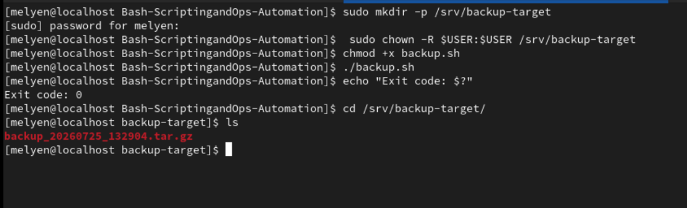
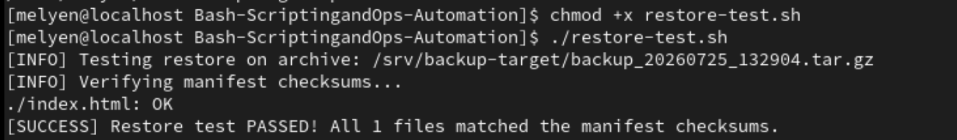
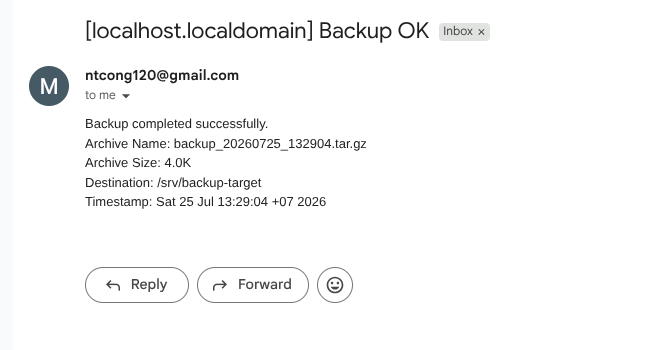
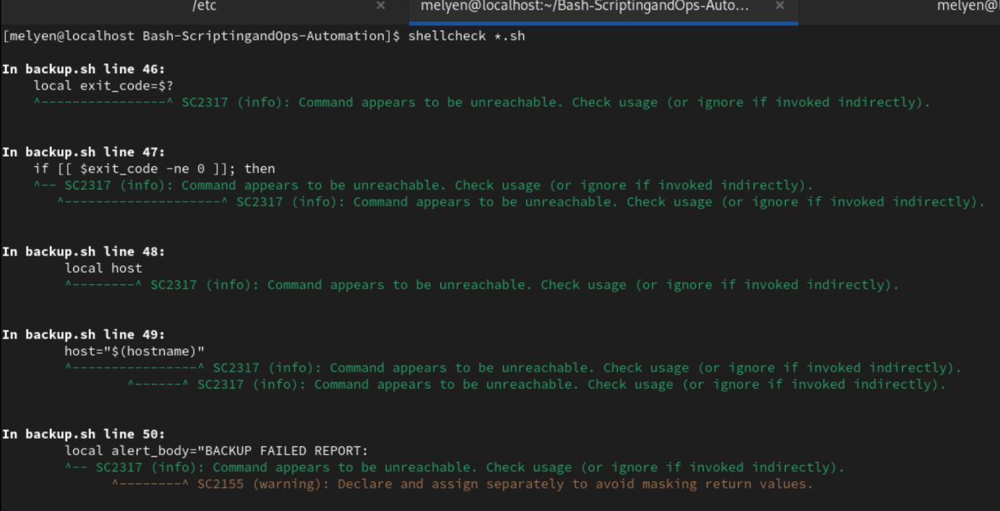
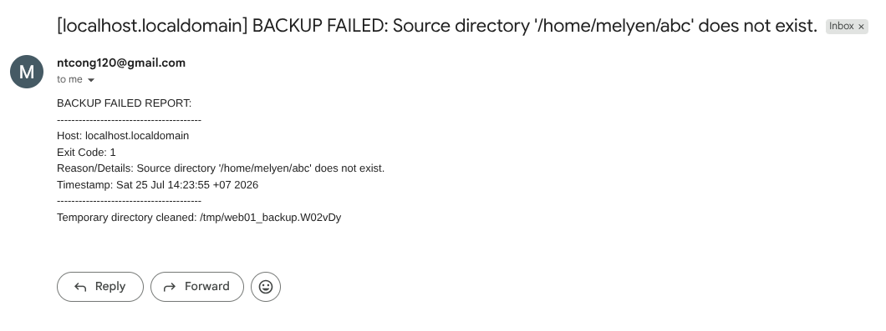

# Bài tập tuần 5: BASH SCRIPTING & OPS AUTOMATION

- **Họ và tên:** Mai Thị Kim Duyên  
- **Mã sinh viên:** 23127185  
- **Host / OS:** `web01` (CentOS Stream 9)  

---

## 1. Môi trường thực thi

### 1.1. Cấu hình Web Endpoint
- Tạo thư mục dữ liệu `~/web01-data` và nội dung trang web:
  ```bash
  mkdir -p ~/web01-data && echo "hello from web01" > ~/web01-data/index.html
  ```
- Khai báo dịch vụ Systemd `myweb`:
  ```bash
    sudo bash -c "cat > /etc/systemd/system/myweb.service <<EOF
    [Unit]
    Description=My Web Server (python3 http.server)
    After=network.target

    [Service]
    Type=simple
    User=$USER
    WorkingDirectory=$HOME/web01-data
    ExecStart=/usr/bin/python3 -m http.server 8080
    Restart=always

    [Install]
    WantedBy=multi-user.target
    EOF"
  ```
- Nạp lại cấu hình và bật dịch vụ `myweb`:
  ```bash
  sudo systemctl daemon-reload
  sudo systemctl enable --now myweb
  ```
- Kiểm tra trạng thái của dịch vụ `myweb`:
  ```bash
  sudo systemctl status myweb
  ```
> **Ghi chú**: Lí do sử dụng Systemd thay cho việc chạy trực tiếp command `python3 -m http.server 8080 &` là để đảm bảo dịch vụ luôn hoạt động ổn định, tự khởi động lại khi gặp lỗi và có thể quản lý dễ dàng thông qua các câu lệnh `systemctl`.


### 1.2. Cấu hình Email Alert Transport
- **Giải pháp lựa chọn:** Cấu hình động kết hợp (Hybrid approach) được viết trong thư viện dùng chung `lib/alert.sh`.
- **Cơ chế hoạt động:** 
  - Ưu tiên dùng `msmtp` hoặc `mail` gửi mail thật nếu máy chủ đã cấu hình.
  - Tự động chuyển hướng ghi log dạng raw email vào `~/alerts.log` nếu không có công cụ gửi mail.

---

## Task 1 — Health-check with email alerting

### Tóm tắt giải pháp
Tệp `health-check.sh` đọc cấu hình từ `/etc/monitoring.env`, kiểm tra lần lượt:
1. Dung lượng ổ cứng root `%` so với `DISK_THRESHOLD`.
2. Dung lượng RAM trống `%` so với `RAM_MIN_FREE`.
3. Trạng thái của các dịch vụ trong danh sách `SERVICES` (`systemctl is-active`).
4. Phản hồi từ HTTP endpoint (`curl -sf --max-time 5`).

Các vi phạm được gom vào mảng `ALERTS=()`. Cuối kịch bản, nếu `ALERTS` có phần tử, hàm `send_alert()` gửi **đúng 1 email** danh sách tất cả cảnh báo.

### Lệnh thực thi

- **Cấp quyền thực thi và chạy kịch bản:**
  ```bash
  chmod +x health-check.sh
  ./health-check.sh
  ```
- **Kiểm tra trạng thái sau khi chạy (Exit Code):**
  ```bash
  echo "Exit code: $?"
  # Output: 0 (Hệ thống bình thường, không phát hiện lỗi)
  ```

### Bằng chứng nghiệm thu

Kiểm tra khi hệ thống bình thường: Giả sử DISK_THRESHOLD = 85. (DISK_THRESHOLD là ngưỡng cảnh báo, khi dung lượng ổ cứng vượt ngưỡng này thì sẽ gửi cảnh báo)


Kiểm tra khi hệ thống không bình thường: Giả sử tắt HTTP endpoint.


Kiểm tra khi hệ thống không bình thường: Giả sử giảm DISK_THRESHOLD xuống 1%.


## Task 2 — Automated backup with safe cleanup
### Tóm tắt giải pháp
Tệp `backup.sh`:
1. Nạp biến từ `/etc/backup.env`, kiểm tra tính hợp lệ của biến.
2. Đăng ký `trap cleanup EXIT`: Xóa thư mục tạm `/tmp/web01_backup.XXXXXX` và gửi email báo lỗi nếu exit code khác 0.
3. Tạo file checksum `manifest.txt` chứa `md5sum` của toàn bộ tệp tin trong `$DATA_DIR` (loại trừ `*.log`, `*.tmp`).
4. Đóng gói nén `.tar.gz` chứa dữ liệu và `manifest.txt`.
5. Đưa bản sao lưu sang `$DEST` và xóa bản sao lưu cũ hơn `$RETAIN_DAYS` ngày (`mtime +N`).
6. Kịch bản `restore-test.sh` giải nén bản sao lưu mới nhất vào thư mục tạm và chạy `md5sum -c manifest.txt` để xác minh tính toàn vẹn.

### Lệnh thực thi

- **Cấp quyền thực thi và chạy kịch bản sao lưu (`backup.sh`):**
  ```bash
  chmod +x backup.sh
  ./backup.sh
  ```
- **Kiểm tra trạng thái sau khi sao lưu (Exit Code):**
  ```bash
  echo "Exit code: $?"
  # Output: 0 (Sao lưu thành công, file .tar.gz được tạo tại DEST)
  ```
- **Cấp quyền thực thi và kiểm tra khôi phục dữ liệu (`restore-test.sh`):**
  ```bash
  chmod +x restore-test.sh
  ./restore-test.sh /srv/backup-target
  ```
  
### Bằng chứng nghiệm thu
- Tạo thư mục backup và cấp quyền cho user
  ```bash
  sudo mkdir -p /srv/backup-target
  sudo chown -R $USER:$USER /srv/backup-target
  ```
- **Sao lưu thành công và khôi phục dữ liệu thành công**



- **Giả lập lỗi & kiểm chứng bẫy lỗi `trap cleanup EXIT`**
- **Thực nghiệm:** Đặt `DATA_DIR="/path/not/exist"` trong cấu hình tạm và chạy kịch bản:


---

## Task 3 — Error trapping and linting (2.0 pts)

### Tóm tắt giải pháp
1. Tích hợp bẫy `trap 'on_error $LINENO "$BASH_COMMAND" $?' ERR` vào kịch bản `backup.sh`.
2. Hàm `on_error()` trích xuất chính xác **số dòng (line number)**, **câu lệnh bị lỗi (command)**, **exit code** và **hostname** để lưu vào biến `ERROR_REASON` trước khi ngắt kịch bản.
3. Bẫy `trap cleanup EXIT` tiếp nhận thông tin từ `on_error()` để gửi email cảnh báo khẩn cấp và dọn dẹp thư mục tạm `/tmp/web01_backup.XXXXXX`.
4. Rà soát cú pháp toàn bộ các tệp kịch bản (`*.sh`) bằng `shellcheck` và khắc phục triệt để các cảnh báo.

### Lệnh thực thi

- **1. Kiểm tra cú pháp tĩnh bằng ShellCheck (Static Analysis):**
  Rà soát cú pháp toàn bộ các tệp kịch bản để đảm bảo không có cảnh báo/lỗi cú pháp trước khi vận hành:
  ```bash
  shellcheck *.sh
  echo "Exit code: $?"
  ```

- **2. Kiểm thử bẫy lỗi `trap ERR` khi thực thi (Forced Runtime Error):**
  Sau khi mã nguồn đã chuẩn cú pháp, chèn câu lệnh cố tình bị lỗi vào `backup.sh` để kiểm thử bẫy lỗi runtime:
  ```bash
  # 1. Chèn câu lệnh cố tình lỗi vào kịch bản
  sed -i '/# 4. Đóng gói/i tar -czf /tmp/out.tgz /no/such/dir' backup.sh

  # 2. Thực thi kịch bản để kích hoạt trap ERR
  ./backup.sh
  ```

### Bằng chứng nghiệm thu

- **Kiểm tra với cú pháp ShellCheck**
!


- **Thực thi kịch bản để kích hoạt trap ERR**
